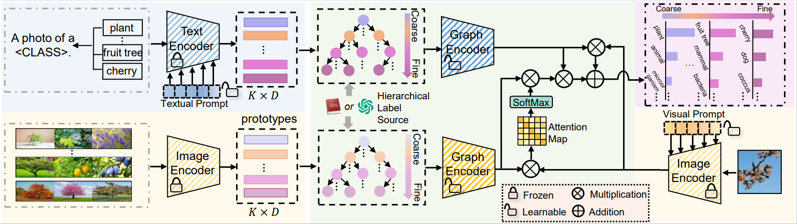

# HGCLIP

## 👀Introduction

This repository contains the code for our paper `HGCLIP: Exploring Vision-Language Models with Graph Representations for Hierarchical Understanding`. [[arXiv](https://arxiv.org/abs/2311.14064)]

Created by [Peng Xia](https://peng-xia.site/), [Xingtong Yu](https://xingtongyu.netlify.app/), [‪Ming Hu‬‬](https://minghu0830.github.io/), [Lie Ju](https://mmai.group/peoples/julie/), [Zhiyong Wang](https://scholar.google.com/citations?user=Sqou_P0AAAAJ&hl=zh-CN&oi=ao), [Peibo Duan](https://research.monash.edu/en/persons/ben-duan), [Zongyuan Ge](https://zongyuange.github.io/).



## 💡Requirements

#### Environment

1. Python 3.8.*
2. CUDA 12.2
3. PyTorch 
4. TorchVision 

#### Install

Create a  virtual environment and activate it.

```shell
conda create -n hgclip python=3.8
conda activate hgclip
```

The code has been tested with PyTorch 1.13 and CUDA 12.2.

```shell
pip install -r requirements.txt
```

## ⏳Dataset

Please first download the required datasets. Follow [prepare_datasets.md](hgclip/data/prepare_datasets.md) to install the datasets.

## 📦Usage

#### Training & Evaluation

To train or evaluation our HGCLIP, you need to first generate and save the prototypes. 

```bash
python generate_prototypes.py \
--dataset 'air' \
--batch_size 64 \
--gpu_id 0 
```

Then run

```bash
cd hgclip
python main.py \
--config configs/air/train_gnn.py
```

#### Zero-Shot Evaluation

To evaluation the performance of zero-shot CLIP, run

```bash
cd zsclip
python zero_shot.py \
--config configs/air/zero_shot_clip.py
```

#### Quick Start

The main script for training and evaluating model performance is `hgclip/main.py`. Here are the list of key arguments:

- `--config`:  In this configuration file, you can define all the arguments included below.

- `--device`: `cuda` or `cpu`

- `--gpu_id`: gpu id

- `--dataset`: dataset name

- `--batch_size`

- `--epochs`

- `--trainer`: training method
  
  - `CoOp`
  
  - `CoCoOp`
  
  - `MaPLe`
  
  - `VPT`
  
  - `PromptSRC`
  
  - `KgCoOp`
  
  - `HGCLIP`

- `--ctx_init`: context initialization

- `--n_ctx`: context length for random initialization

- `--lr`: learning rate

- `--optimizer`: optimizer
  
  - `sgd`
  
  - `adam`
  
  - `adamw`

## 🙏Acknowledgements

We use code from [MaPLe](https://github.com/muzairkhattak/multimodal-prompt-learning), [CoCoOp-CoOp](https://github.com/KaiyangZhou/CoOp) and [CLIP](https://github.com/openai/CLIP). We thank the authors for releasing their code.

## 📧Contact

If you have any questions, please create an issue on this repository or contact at [peng.xia@monash.edu](mailto:peng.xia@monash.edu).

## 📝Citing

If you find this code useful, please consider to cite our work.
```bibtex
@article{xia2023hgclip,
 title={HGCLIP: Exploring Vision-Language Models with Graph Representations for Hierarchical Understanding},
 author={Xia, Peng and Yu, Xingtong and Hu, Ming and Ju, Lie and Wang, Zhiyong and Duan, Peibo and Ge, Zongyuan},
 journal={arXiv preprint arXiv:2311.14064},
 year={2023}
}
```
